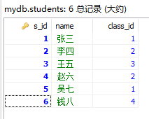
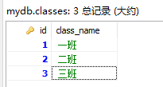
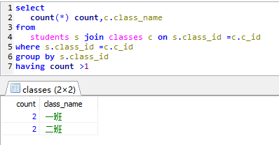
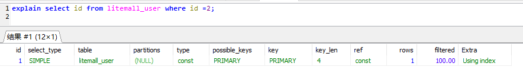

<!-- TOC -->

- [Mysql架构](#mysql%E6%9E%B6%E6%9E%84)
    - [安装](#%E5%AE%89%E8%A3%85)
        - [- ### docker安装](#---docker%E5%AE%89%E8%A3%85)
        - [- ### rpm安装](#---rpm%E5%AE%89%E8%A3%85)
        - [- ### 修改字符集](#---%E4%BF%AE%E6%94%B9%E5%AD%97%E7%AC%A6%E9%9B%86)
        - [- ### docker-compose 安装](#---docker-compose-%E5%AE%89%E8%A3%85)
        - [- ### 重要目录](#---%E9%87%8D%E8%A6%81%E7%9B%AE%E5%BD%95)
    - [mysql 配置文件](#mysql-%E9%85%8D%E7%BD%AE%E6%96%87%E4%BB%B6)
        - [二进制日志文件 log-bin](#%E4%BA%8C%E8%BF%9B%E5%88%B6%E6%97%A5%E5%BF%97%E6%96%87%E4%BB%B6-log-bin)
        - [错误日志文件 log-error](#%E9%94%99%E8%AF%AF%E6%97%A5%E5%BF%97%E6%96%87%E4%BB%B6-log-error)
        - [查询日志 log](#%E6%9F%A5%E8%AF%A2%E6%97%A5%E5%BF%97-log)
        - [数据文件](#%E6%95%B0%E6%8D%AE%E6%96%87%E4%BB%B6)
    - [分层架构](#%E5%88%86%E5%B1%82%E6%9E%B6%E6%9E%84)
        - [连接层](#%E8%BF%9E%E6%8E%A5%E5%B1%82)
        - [业务逻辑处理层](#%E4%B8%9A%E5%8A%A1%E9%80%BB%E8%BE%91%E5%A4%84%E7%90%86%E5%B1%82)
        - [数据存储引擎层](#%E6%95%B0%E6%8D%AE%E5%AD%98%E5%82%A8%E5%BC%95%E6%93%8E%E5%B1%82)
        - [文件存储层](#%E6%96%87%E4%BB%B6%E5%AD%98%E5%82%A8%E5%B1%82)
    - [存储引擎](#%E5%AD%98%E5%82%A8%E5%BC%95%E6%93%8E)
        - [查询语句](#%E6%9F%A5%E8%AF%A2%E8%AF%AD%E5%8F%A5)
        - [MyISAM 和 InnoDB 对比](#myisam-%E5%92%8C-innodb-%E5%AF%B9%E6%AF%94)
- [索引优化分析](#%E7%B4%A2%E5%BC%95%E4%BC%98%E5%8C%96%E5%88%86%E6%9E%90)
    - [sql性能下降原因](#sql%E6%80%A7%E8%83%BD%E4%B8%8B%E9%99%8D%E5%8E%9F%E5%9B%A0)
    - [join理论](#join%E7%90%86%E8%AE%BA)
        - [机读执行顺序](#%E6%9C%BA%E8%AF%BB%E6%89%A7%E8%A1%8C%E9%A1%BA%E5%BA%8F)
        - [join类型](#join%E7%B1%BB%E5%9E%8B)
    - [索引](#%E7%B4%A2%E5%BC%95)
        - [定义](#%E5%AE%9A%E4%B9%89)
        - [索引的优劣](#%E7%B4%A2%E5%BC%95%E7%9A%84%E4%BC%98%E5%8A%A3)
        - [索引分类](#%E7%B4%A2%E5%BC%95%E5%88%86%E7%B1%BB)
        - [索引结构](#%E7%B4%A2%E5%BC%95%E7%BB%93%E6%9E%84)
            - [BTree](#btree)
            - [B+Tree<br>](#btreebr)
            - [Hash索引](#hash%E7%B4%A2%E5%BC%95)
        - [索引场合](#%E7%B4%A2%E5%BC%95%E5%9C%BA%E5%90%88)
            - [适合创建索引的场合](#%E9%80%82%E5%90%88%E5%88%9B%E5%BB%BA%E7%B4%A2%E5%BC%95%E7%9A%84%E5%9C%BA%E5%90%88)
            - [不适合创建索引的场合](#%E4%B8%8D%E9%80%82%E5%90%88%E5%88%9B%E5%BB%BA%E7%B4%A2%E5%BC%95%E7%9A%84%E5%9C%BA%E5%90%88)
    - [性能分析](#%E6%80%A7%E8%83%BD%E5%88%86%E6%9E%90)
        - [mysql优化器](#mysql%E4%BC%98%E5%8C%96%E5%99%A8)
        - [常见瓶颈](#%E5%B8%B8%E8%A7%81%E7%93%B6%E9%A2%88)
        - [explain](#explain)
- [查询截取分析](#%E6%9F%A5%E8%AF%A2%E6%88%AA%E5%8F%96%E5%88%86%E6%9E%90)
- [事务隔离级别](#%E4%BA%8B%E5%8A%A1%E9%9A%94%E7%A6%BB%E7%BA%A7%E5%88%AB)
- [ACID原理](#acid%E5%8E%9F%E7%90%86)

<!-- /TOC -->


# Mysql架构

## 安装

- ### docker安装
    [dockerhub-mysql](https://registry.hub.docker.com/_/mysql)
    mysql的tag列表
    ```
    Supported tags and respective Dockerfile links
    8.0.22, 8.0, 8, latest
    5.7.32, 5.7, 5
    5.6.50, 5.6
    ```

    运行容器
    ``` sh 
    # 为数据目录添加容器卷，以实现持久化
    docker run -p 3306:3306 --name mysql \
    -v /vagrant_data/mysql/conf:/etc/mysql/conf.d \
    -v /vagrant_data/mysql/logs:/logs \
    -v /vagrant_data/mysql/data:/var/lib/mysql \
    -e MYSQL_ROOT_PASSWORD=123456 \
    --restart=always \
    -d mysql:5.7.32
    ```

    测试一下
    ``` sh
    [root@localhost mysql]# docker exec -it e8ff87a1fbf8 mysql -uroot -p123456
    mysql: [Warning] Using a password on the command line interface can be insecure.
    Welcome to the MySQL monitor.  Commands end with ; or \g.
    Your MySQL connection id is 3
    Server version: 5.7.32 MySQL Community Server (GPL)

    Copyright (c) 2000, 2020, Oracle and/or its affiliates. All rights reserved.

    Oracle is a registered trademark of Oracle Corporation and/or its
    affiliates. Other names may be trademarks of their respective
    owners.

    Type 'help;' or '\h' for help. Type '\c' to clear the current input statement.

    mysql>
    ```

- ### rpm安装

    去官网下载 mysql rpm 包

    检查是否安装过
    ``` sh
    #检查安装包
    rpm -qa | grep mysql

    #检查该软件的端口
    ps -ef | grep mysql
    ```

    安装
    ``` sh
    rpm -ivh 服务端包名
    rpm -ivh 客户端包名
    ```

    启动服务
    ``` sh
    service mysql start
    systemctl start mysql 
    ```

    设置root账户
    ``` sh
    /usr/bin/mysqladmin -u root password 123456
    ```

    查看运行级别
    ``` sh
    chkconfig --list | grep mysql

    mysql         0:off   1:off   2:on    3:on    4:on    5:on    6:off
    ```

    如果345是off
    ``` sh
    chkconfig --level 345 mysql on
    ```

- ### 修改字符集
    ``` sql
    # 查询当前字符集
    show variables like 'character%';
    show variables like '%char%';
    ```
    ``` sql
    mysql> show variables like 'character%';
    +--------------------------+----------------------------+
    | Variable_name            | Value                      |
    +--------------------------+----------------------------+
    | character_set_client     | latin1                     |
    | character_set_connection | latin1                     |
    | character_set_database   | latin1                     |<---- #此处是拉丁
    | character_set_filesystem | binary                     |
    | character_set_results    | latin1                     |
    | character_set_server     | latin1                     |
    | character_set_system     | utf8                       |
    | character_sets_dir       | /usr/share/mysql/charsets/ |
    +--------------------------+----------------------------+
    ```

    配置文件

    |   版本     |    原始文件                  |   拷贝路径    |
    |   ----     |         ----                |   ----     |
    | 5.5之前    | /usr/share/mysql/my-huge.cnf | /etc/my.cnf |
    | 5.5~5.7.18 | /usr/share/mysql/my-default.cnf | /etc/my.cnf |
    | 5.7.18之后 | 不提供             | 自创建/etc/my.cnf |

    新建或者复制出一个 `/etc/my.cnf`，添加如下配置，然后`重启服务`
    ``` ini
    # mysqld
    [mysqld]
    character-set-server=utf8
    collation-server=utf8_general_ci
    init_connect='SET NAMES utf8'

    # client
    [client]
    default-character-set=utf8
    ```

    > 需要注意的是这种方式只能使这`之后建的库`默认编码是utf8，<br>
    在修改配置文件之前创建的库，只能通过其他方式去修改编码，<br>
    因此推荐在安装之初立刻修改字符集编码

- ### docker-compose 安装

    docker-compose.yml
    ``` yaml
    version: "3.8"
    services:
    mysql:
        ports:
        - "3306:3306"
        volumes:
        - /vagrant_data/mysql/conf:/etc/mysql/conf.d:ro
        - /vagrant_data/mysql/logs:/logs
        - /vagrant_data/mysql/data:/var/lib/mysql
        environment:
        - MYSQL_ROOT_PASSWORD=123456
        build:
        context: . # 指定Dockerfile, .代表当前目录下的默认Dockerfile文件
        container_name: mmysql
    ```

    Dockerfile
    ``` dockerfile
    FROM mysql:5.7.32
    COPY files/my.cnf /etc/my.cnf
    RUN chmod -R 644 /etc/my.cnf
    CMD ["mysqld"]
    ENTRYPOINT ["docker-entrypoint.sh"]
    ```

    my.cnf
    ``` ini
    # mysqld
    [mysqld]
    character-set-server=utf8
    collation-server=utf8_general_ci
    init_connect='SET NAMES utf8'

    # client
    [client]
    default-character-set=utf8
    ```

    结构
    ``` sh
    .
    ├── docker-compose.yml
    ├── Dockerfile
    └── files
        └── my.cnf

    1 directory, 3 files
    ```

    运行
    ``` docker
    docker-compose up -d
    ```


- ### 重要目录

    |   路径            |    解释                |   备注    |
    |   ----            |         ----           |   ----     |
    | /var/lib/mysql/   | mysql数据库文件存放路径 | /var/lib/mysql/atguigu.cloud.pid |
    | /usr/share/mysql  | 配置文件目录             | mysql.server命令及配置文件 |
    | /usr/bin          | 相关命令目录             | mysqladmin mysqldump等命令 |
    | /etc/init.d/mysql | 启停相关脚本             | |

## mysql 配置文件

### 二进制日志文件 log-bin

- 主从复制

### 错误日志文件 log-error

- 默认是关闭的

### 查询日志 log

### 数据文件

- 默认路径 
    > `/var/lib/mysql`
- 查看全部库

    ``` sh
    [root@localhost test03_mysql]# docker exec -it c8267c78a8e0 ls -l /var/lib/mysql | grep ^d
    drwxrwxrwx 1 1000 1000    28672 Nov 14 07:20 mysql
    drwxrwxrwx 1 1000 1000    40960 Nov 14 07:20 performance_schema
    drwxrwxrwx 1 1000 1000    49152 Nov 14 07:20 sys
    ```

- `frm` 文件
    > 存放表结构

- `myd` 文件
    > MyISAM 存放表数据的文件

- `myi` 文件
    > MyISAM 存放表索引的文件

- `ibd` 文件
    > InnoDB 引擎存放表数据和表索引的文件

- `opt` 文件
    > 记录该库的默认字符集编码和字符集排序规则<br>
    如果创建数据库指定了默认字符集和排序规则，而后续创建的表如果 `没有指定` 字符集和排序规则，那么该新建的表将 `采用db.opt文件中指定的属性`

## 分层架构


### 连接层

> 最上层的一些 `客户端和连接服务`，包含本地sock通信和大多数基于客户端/服务端工具实现的tcp/ip通信<br>
> 主要进行连接处理，授权认证，及相关的安全方案<br>

> 引入线程池的概念，提供线程<br>
> 亦可实现基于ssl的安全连接<br>
> 服务器会为安全接入的每个客户端验证它所具备的操作权限


### 业务逻辑处理层

> 主要完成大多数的核心服务功能<br>
> 在该层，<br>
> 服务器会解析查询并创建相应的内部解析树，并对其完成相应的优化，如：确定查询顺序，以及是否利用索引<br>
> 最后生成相应的执行操作<br>
> 如果是select语句，还会查询内部缓存 (缓存空间大小一定程度上决定了大量读操作时的系统性能)

- 连接池 `connection pool`
    > 主要与连接层的应用程序进行交互

- 管理服务和工具 `management services & utilltles`
    >包括 备份、容灾、安全、恢复、集群等等

- SQL 接口 `interface`
    > 根据语句关键词分析语句构成，存储过程、视图、触发器等等

- 解析器 `parser`
    > 将sql语句加载过滤按照一定的顺序去解析

    1. from
    2. on
    3. join
    4. where
    5. group by(开始使用select中的别名，后面的语句中都可以使用)
    6. avg,sum....等聚合函数
    7. having
    8. select
    9. distinct
    10. order by

- 优化器 `optimizer`
    > 在分析和解析完成后，优化器会对语句进行优化 (确定查询顺序，以及是否利用索引等)，最终按照一定的顺序去执行

    一条sql语句在执行前，可以有多种不同的执行方案，优化器会找出执行该语句的所有可能使用的优化方案，对比之后找出成本最低的执行方案，即`执行计划`<br>
    优化过程大致如下：<br>
    1. 根据搜索条件，找出所有可能使用的索引<br>
    2. 计算全表扫描的代价<br>
    3. 计算使用不同索引执行查询的代价<br>
    4. 对比各种执行方案的代价，找出成本最低的一个

- 缓存和缓冲 `caches & buffers`
    > 服务器会查询内部的缓存,如果缓存空间足够大,这样可以解决大量读操作的环境中,能够很好的提升系统性能

### 数据存储引擎层

> 存储引擎负责mysql数据库中数据的存储与提取<br>
> 服务器通过api与存储引擎进行通信<br>
> 不同的存储引擎具有不同的功能，它也具有 `可拔插组件化` 的特点，可以根据实际使用需求选取

### 文件存储层

> 数据存储于文件系统中，完成与存储引擎的交互

## 存储引擎

### 查询语句

- 查看所有的引擎类型

    ``` sql
    mysql> show engines;
    ```
    ``` 
    +--------------------+---------+----------------------------------------------------------------+--------------+------+------------+
    | Engine             | Support | Comment                                                        | Transactions | XA   | Savepoints |
    +--------------------+---------+----------------------------------------------------------------+--------------+------+------------+
    | InnoDB             | DEFAULT | Supports transactions, row-level locking, and foreign keys     | YES          | YES  | YES        |
    | MRG_MYISAM         | YES     | Collection of identical MyISAM tables                          | NO           | NO   | NO         |
    | MEMORY             | YES     | Hash based, stored in memory, useful for temporary tables      | NO           | NO   | NO         |
    | BLACKHOLE          | YES     | /dev/null storage engine (anything you write to it disappears) | NO           | NO   | NO         |
    | MyISAM             | YES     | MyISAM storage engine                                          | NO           | NO   | NO         |
    | CSV                | YES     | CSV storage engine                                             | NO           | NO   | NO         |
    | ARCHIVE            | YES     | Archive storage engine                                         | NO           | NO   | NO         |
    | PERFORMANCE_SCHEMA | YES     | Performance Schema                                             | NO           | NO   | NO         |
    | FEDERATED          | NO      | Federated MySQL storage engine                                 | NULL         | NULL | NULL       |
    +--------------------+---------+----------------------------------------------------------------+--------------+------+------------+;
    ```

- 查看当前默认使用的存储引擎

    ``` sql
    mysql> show variables like '%storage_engine%';
    +----------------------------------+--------+
    | Variable_name                    | Value  |
    +----------------------------------+--------+
    | default_storage_engine           | InnoDB |
    | default_tmp_storage_engine       | InnoDB |
    | disabled_storage_engines         |        |
    | internal_tmp_disk_storage_engine | InnoDB |
    +----------------------------------+--------+
    ```

### MyISAM 和 InnoDB 对比

- 对比图
    |   对比项            |    MyISAM                |   InnoDB    |
    |   ----            |         ----           |   ----     |
    | 主外键   | 不支持 | 支持 |
    | 事务  | 不支持 | 支持 |
    | 锁  | 表锁，即使只是操作一条数据也会锁住整个表，`不适用于高并发场景` | 行锁，操作时只锁住该行，`适合高并发` |
    | 缓存 | 索引缓存 | 索引缓存和数据缓存，对内存要求较高，内存大小对性能有决定性影响 |
    | 关注点 | 性能 | 事务 |
    | 索引 | 非聚簇索引 | 聚簇索引 |


# 索引优化分析

## sql性能下降原因

具体表现为执行时间长，等待时间长

-  查询语句差

-  索引失效

-  关联查询join太多<br>
    设计缺陷或是不得已的需求


## join理论

### 机读执行顺序
 1. from<br>
    对from子句中前两个表执行笛卡尔乘积（即两个表每一行数据都进行组合，有m条数据的m表和n条数据的n表组合，就是有 `m*n` 条数据的虚拟表），生成虚拟表t1<br>
    
    <br>
    连接后<br>
    
 2. on<br>
    on子句中的逻辑表达式将会应用到t1的各个行中，筛选出符合表达式的行，生成虚拟表t2<br>
    
    
 3. join<br>
    如果是outer join就将添加外部行，left或者right join 都将添加在前一步过滤掉的左或者右表中的行，生成虚拟表t3<br>
    <br>

    使用outerjoin得到的一定是左或者右的整个集合，on的作用体现在，这个集合中的符合on条件的所有t1中的结果都会体现出来，即使是外键的关联也是如此<br>
    


    > 如果还有表要连接，其实也是重复上面三个步骤，将第三个表和t3进行笛卡尔乘积，再筛选on子句，再判断是否外连
 4. where<br>
    对t3进行筛选，生成虚拟表t4<br>
    
    <br>
    on和where的区别:<br>
    where是最终筛选，on移除的行会在outerjoin时添加回来<br>
    > `使用outerjoin和where，且条件相同，则和innerjoin所查询的结果集没有任何区别`
 5. group by(开始使用select中的别名，后面的语句中都可以使用)
    将t4中相同的值合为一组，得到虚拟表t5，使用groupby，则后续所有步骤都得带上聚合函数，因为一组数据只会在结果集中体现一行<br>
    
 6. avg,sum....等聚合函数
 7. having<br>
    应用having筛选器生成t6，是第一个也是唯一一个应用到已分组数据的筛选器<br>
    
 8. select<br>
    筛选出指定的列，生成虚拟表t7
 9.  distinct<br>
    将t7中的数据移除相同的行，生成虚拟表t8，如果应用了groupby语句那么这个步骤是多余的，因为其本身就是将相同的数据分组，生成了唯一的行
 10. order by<br>
    使用orderby子句排序t8，返回的是一个游标，而不是虚拟表。
    `sql本身是基于集合的理论的`，集合`不会对自己的成员预先排序`。对表进行排序的查询会返回一个对象，`这个对象包含特定的物理顺序的逻辑组织`，这个对象就是游标。所以`orderby子句查询不能作用于表表达式`，包括视图、内联表值函数、子查询、派生表和共用表表达式等<br>
    
 11. top选项<br>
    应用top选项，返回结果给请求者

### join类型

1. 内连(交集) `inner join`
2. 左连(左集合) `left join`
3. 右连(右集合) `right join`
4. 左连(左独占) `left join ... is null`
5. 右连(右独占) `right join ... is null`
6. 全连(并集) `full outer join (mysql使用union)`
7. 全连(各自独占并集) `full outer join ... is null and ... is null`


## 索引

### 定义
- >在数据之外，数据库系统还维护着满足特定查找算法的数据结构，这些数据结构以某种方式指向数据，这样就可以在这些数据结构的基础上实现高级查找算法，这就是索引<br>

    >简而言之，`索引就是排好序的快速查找数据结构`，<br>

    > 因此索引影响到的是 `where` 和 `orderby` 子句

- > 一般来说索引本身也很大，不可能全部存在于内存中，因此往往 `以索引文件的形式存储在磁盘上`

- > 我们常说的索引，如果没有特别指明，多是指 `B树` (多路搜索树，并不一定是二叉树) 结构组织的索引<br>

    > 其中聚集索引、复合索引、前缀索引和唯一索引都是 `B+树` 索引，统称索引

    > 也有 hash索引等
    
### 索引的优劣

- 优点<br>
    1. 提高了检索效率，降低了数据库的IO成本
    2. 通过索引进行排序，降低数据库排序的成本，降低了CPU的消耗

- 劣势<br>
    1. 索引的本质也是一张表，该表保存了主键和索引字段，并指向实体表的记录，所以索引列也占空间
    2. 索引会影响表的更新操作的速度，因为更新表时，不仅要更新数据，还要更新索引
    3. 索引只是提高效率的一个因素而已，如果有大量表，就需要花费大量时间研究建立最优秀的索引，或优化查询


### 索引分类

- 基本语法<br>
    ``` sql
    # 创建索引
    create [unique] index indexName on mytable(columnname(length))

    # 添加主键 (主键本质就是唯一索引)
    ALTER TABLE tbl_name ADD PRIMARY KEY (column_list)
    # 添加唯一索引，索引值必须唯一
    ALTER TABLE tbl_name ADD UNIQUE index_name (column_list)
    # 添加普通索引
    ALTER TABLE tbl_name ADD INDEX index_name (column_list)
    # 添加全文索引
    ALTER TABLE tbl_name ADD FULLTEXT index_name (column_list)
    ```
    ``` sql
    # 删除索引
    drop index [indexName] on mytable
    ```
    ``` sql
    # 查看索引
    show index from table_name
    ```


- 单值索引
    > 一个索引只包含单个列<br>

    > 注意：<br>
    > - 尽量选择不重复值的字段<br>
    > - 一般不要超过5个索引
- 唯一索引
    > 索引列的值必须唯一，但允许为空
- 复合索引
    > 即一个索引包含多个列<br>

    - 最左匹配原则：<br>
        > sql语句`用到了`联合索引中`最左侧的索引`，那么这个sql语句就可以利用这个联合索引去进行匹配，当`遇到范围查询(>、<、between、like)时会停止匹配`

        假如我们建立了索引(a,b)，where后语句
        ``` sql
        a = 1
        a = 1 and b = 1
        b = 1 and a = 1 
        ``` 
        都可以匹配索引，语句的顺序无关紧要，因为优化器会自动调整顺序与索引保持一致<br>
        但是如果直接
        ``` sql
        b = 1
        ```
        则无法匹配，因为不符合最左匹配原则
        > 因此，建立复合索引时，一定要`将区分度最高的字段放到最左侧`

    - 最左匹配原理:<br>
        

        如图：<br>
        对(a,b)建立复合索引，在a相等的情况下，按照b来排序<br>
        a是有序的状态`[1,1,2,2,3,3]`，b则是全局无序的状态`[1,2,1,4,1,2]`，<br>
        因此b = 1这种查询条件无法使用索引，但当a=2时，b则是局部有序的`[1,4]`，此时b可以使用索引。<br>
        因此 `a = 1 and b = 1 `是a、b都可以使用索引的，而 `a > 1 and b = 1` a的值是一个范围，并不固定，在这个范围内，b则是无序的`[1,4,1,2]`，因此只有a能使用到索引。

    - 匹配原则<br>

        1. 区分度越高越优先
            ``` sql
            SELECT * FROM table WHERE a = 1 and b = 2 and c = 3; 
            ```
            建立(a,b,c)或者(c,b,a)或者(b,a,c)都可以，重点是要让区分度高的字段放在前面，以使后续的字段缩小搜索范围

        2. 范围查询置后
            ``` sql
            SELECT * FROM table WHERE a > 1 and b = 2; 
            ```
            建立(b,a)，两个字段都能用上索引，相反，则只能a用上，遇到范围查询就停止
            ``` sql
            SELECT * FROM `table` WHERE a > 1 and b = 2 and c > 3; 
            ```
            建立(b,a)或者(b,c)，多个范围查询，在第一次范围查询时，后面的字段就是局部无序了，无需再添加索引

        3. 排序置后
            ``` sql
            SELECT * FROM `table` WHERE a = 1 ORDER BY b;
            ```
            建立(a,b)，a=1时，b局部有序，因此`可以避免再次排序`
            ``` sql
            SELECT * FROM `table` WHERE a > 1 ORDER BY b; 
            ```
            建立(a)，a范围查询，因此b本就是无序状态，没有必要对b建立索引
            ``` sql
            SELECT * FROM `table` WHERE a = 1 and c = 1 ORDER BY b;
            ```
            建立(a,c,b)，如果建立索引(a,b,c)，按照sql的执行顺序，orderby晚于where，因此索引终止于b
            
        4. IN无关紧要
            ``` sql
            SELECT * FROM `table` WHERE a IN (1,2,3) and b > 1; 
            ```
            建立(a，b)，IN可以视为等值引用，不会终止索引匹配


### 索引结构

#### BTree
> B 树是为了磁盘或其它存储设备而设计的一种多叉平衡查找树。（相对于二叉，B树每个内结点有多个分支，即多叉）


- 特点：
    > - 每个内部节点(假设其关键字个数为 `n`) 包含 `n+1`个指向他孩子的指针
    >   - key(关键字) 和指针相互间隔，节点的两端是指针，所以指针比 key 多一个
    >   - 每个指针要么为null，要么指向另一个节点
    > - key 对各子树的关键字进行分割
    >   - 指针在节点最左侧且不为null，则该指针指向的节点中的关键字都是小于最小key的
    >   - ...右侧...大于...最大key
    >   - 指针在左右相邻的key的中间，则该指针指向的节点的关键字都是在这两个key的区间内的
    > - 每个叶子节点的深度相同
    > - 每个节点的关键字个数有上下界，用 `t(t>1)` 来衡量
    >   - 根节点以外的节点，至少有 `t-1` 个关键字，至少有 `t` 个子节点(指针)
    >   - 根节点以外的节点，至多有 `2t-1` 个关键子，至多有 `2t` 个子节点(指针)，这种情况，称该节点是满的(full)

- 模拟查找29的过程<br>
  - 第一次IO操作<br>
      根据根指针节点，找到文件目录的根磁盘块1，将其中信息导入内存
  - 第二次IO操作<br>
      此时内存中有两个文件名17、35和其他3个存储其他磁盘地址的指针，根据算法找到指针P2，定位到磁盘块3，将信息导入内存
  - 第三次IO操作<br>
      此时内存中有两个文件名26、38和其他3个存储其他磁盘地址的指针，根据算法找到指针P2，定位到磁盘块8，将信息导入内存<br>
      根据算法我们查找到文件29，并定位了该文件内存的磁盘地址。
    

#### B+Tree<br>


- 特点：
    > - 非叶子节点的子树指针和关键字个数相同
    >   - BTree 是指针数比关键字数大 1
    > - 非叶子节点的子树指针`P[i]`，指向关键字属于`[K[i],K[i+1]]`的子树
    >   - 如图中所示，第一层的P1指针，指向的是区间[5,28]的子树
    >   - BTree 是开区间
    > - 所有关键字都在叶子节点出现，叶子节点相当于存储关键字的数据层
    >   - BTree 中间节点也会有
    > - B+树只有达到叶子节点才命中
    > - 为所有叶子结点增加一个链指针，即图中的 Q

- 同使用B+Tree的InnoDB与MyISAM的区别：

  1. InnoDB的数据文件本身就是索引文件
      > 在InnoDB中，表数据文件本身就是按照B+Tree组织的一个索引结构，这棵树的叶子节点data保存了完整的数据记录<br>
      这个索引的key是数据表的主键，因此InnoDB表数据文件本身就是主索引

  2. 聚簇索引<br>
      <br>
      > `叶子节点包含完整的数据记录`，这种索引叫做聚簇索引。`将数据存储与索引放到了一块，找到索引也就找到了数据`<br>
      聚簇索引具有`唯一性`(数据跟索引结构放到一块，因此`一个表仅有一个聚簇索引`)<br>

      > 聚簇索引`默认是主键`，如果表中没有定义主键，InnoDB会选择一个`唯一的非空索引代替`，如果没有这样的索引，会隐式定义一个主键来作为聚簇索引<br>

      
      > InnoDB中，在聚簇索引之上创建的索引称之为辅助索引，`辅助索引访问数据总是需要二次查找`，`非聚簇索引都是辅助索引`，如复合索引、前缀索引、唯一索引等，辅助索引叶子节点存储的都不再是行的物理位置，而是主键值

      <br>

      如图所示：<br>
      - InnoDB使用的是聚簇索引，将主键组织到一颗B+Tree中，`行数据就存储在叶子节点`上，若使用 `where id = 5` 这样的条件查找主键，按照B+Tree的`检索算法即可得到对应的叶子节点`，之后获得行数据
      - 如果对name字段进行条件搜索，则需要两个步骤：第一步，`在辅助索引B+Tree中检索name`，`到达叶子节点获取对应的主键`，第二步，`使用主键在主索引B+Tree中再执行一次检索操作`，最终`到达叶子节点获取完整行数据`

  3. 非聚簇索引<br>
      <br>
      > 将数据存储于索引分开结构，索引结构的叶子节点指向了数据的对应行，`叶节点`的data域`存放的是数据记录的地址`<br>
      > MyISAM通过将key_buffer把索引先缓存到内存中，当需要访问数据时，在`内存中搜索索引`，然后`通过索引找到磁盘对应数据`<br>

      <br>
      如图所示：<br>
      - MyISAM使用的是非聚簇索引，两棵B+Tree看起来并无不同，`节点结构一致，只是存储内容有所区别`，主键索引B+Tree叶子节点存储主键，辅助键索引B+Tree叶子节点存储辅助键，`表数据存储于独立的文件中，叶子节点都是用一个地址指向表数据`。
      - `索引树是独立的`，通过辅助键检索无需访问主键索引树

    4. 主键建议使用自增id<br>
        如果使用自增id作为主键，聚簇索引的`数据的物理存放顺序与索引顺序是一致的`，即：只要索引是相邻的，那么对应的数据一定也是相邻地存放在磁盘上的。<br>

        MyISAM的主索引并非聚簇索引，那么他的数据的物理地址必然是凌乱的，拿到这些物理地址，按照合适的算法进行I/O读取，于是开始不停的寻道不停的旋转。`聚簇索引则只需一次I/O`<br>
        
        如果涉及到大数据量的排序、全表扫描、count之类的操作的话，还是MyISAM占优势些，因为索引所占空间小，这些操作是需要在内存中完成的。


- 聚簇索引优点

    1. `行数据与叶子节点存储在一起`，同一页（Innodb存储的最基本结构）会有多条行数据，访问同一数据页的不同行数据时，第一次访问便已经把该`页数据载入buffer`中了，再次访问时`会在内存中访问，不必访问磁盘`。主键和行数据一起被载入内存，找到叶子节点时，就立刻可以返回改行数据

    2. 辅助索引使用主键作为指针，而不使用地址值作为指针<br>
        当出现行移动或者数据页分裂时，无需更新辅助索引中的指针，使用`聚簇索引就可以保证不管这个主键B+树的节点如何变化，辅助索引树都不受影响`
    
    3. 适合排序的场合(B+Tree特点)
    4. 适合取出范围数据(B+Tree特点)

- 聚簇索引缺点

    1. 维护索引成本高<br>
        插入新行或者主键被更新需要重新分页时，建议在负载较低时，通过[OPTIMIZE TABLE](cnblogs.com/jimmy-muyuan/p/5874410.html)优化表，因为必须被移动的行数据可能会造成碎片

    2. 不适合使用uuid作为主键<br>
        uuid作为主键，`新的记录可能会插入到之间的记录中间`，导致`需要强制移动之前的记录`，被写满且已经刷到磁盘上的`页可能会被重新读取`，数据存储稀疏，这就会出现聚簇索引有可能有比全表扫面更慢<br>
        使用自增id作为主键，`每条新纪录总是在之前一条记录后面插入`，当达到页的最大填充因子数时，下一条记录就会写入新的页中。也正是这个原因，`主键页会近似于被顺序的数据填满`

    3. 主键过大会导致辅助索引变得更大<br>
        辅助索引的叶子节点是主键值，过长的主键值，会导致非叶子节点占用过多的物理空间

#### Hash索引

### 索引场合

#### 适合创建索引的场合

1. 主键自动建立唯一索引
2. 频繁作为查询条件的字段应创建索引
3. 查询中与其他表关联的字段，外键关系创建索引
4. 频繁更新的字段不适合创建索引，更新记录还需更新索引加重了IO负担
5. where用不到的字段不创建索引
6. 单值/复合索引取舍，高并发倾向于复合索引
7. 查询中排序的字段，通过索引访问排序速度提升
8. 查询中统计或者分组字段

#### 不适合创建索引的场合

1. 表记录太少
2. 经常增删改，查询效率提升，增删改效率下降了，更新数据还需更新索引
3. 数据重复且分布平均的字段，

## 性能分析

### mysql优化器

### 常见瓶颈

1. CPU：CPU饱和通常发生在数据装入内存或从磁盘上读取数据的时候
2. IO：发生在装入数据大于内存容量的时候

### explain

> 模拟优化器执行sql查询语句，从而知道mysql是如何处理sql语句的

- 作用<br>
    表的读取顺序<br>
    数据读取操作的操作类型<br>
    哪些索引可以被使用<br>
    哪些索引被实际使用<br>
    表之间的引用<br>
    每张表有多少行被优化器查询

- 字段名
    1. id：<br>
        select查询的序列号，包含一组数字，表示查询中执行的select子句和操作表的顺序<br>

        - id相同，执行顺序由上到下<br>
        - id不同，如果是子查询，`id越大，优先级越高，位置越靠里，越先被执行`<br>
        - id部分相同，id越大，优先级越高，越先执行；`id相同，顺序执行`
    
    2. select_type: <br>
        查询的类型，区分普通查询、联合查询、子查询等

        - simple: 简单的select查询，查询中不包含子查询或者union<br>
        - primary: 查询中若包含任何的子部分，最外层会被标记为primary
        - subquery: 即子查询的部分
        - derived: 在from列表中包含的子查询被标记为DERIVED(衍生)，mysql会递归执行这些子查询，把结果放在临时表里。在table中会出现\<derived2\>这种结果，2指id，指向的便是id为2的子查询，说明改行便是这个子查询产生的临时表<br>
        - union: 若第二个select出现在union之后，则被标记为union；若union出现在from子句的子查询外，外层的select会被标记为derived
        - union result: 从union表获取结果的select<br>
        <br>

        如图：
        primary代表最外层select，derived代表行2的子查询，union代表行4的子查询，union result代表行2和行4的union后的虚拟表

    3. table:<br>
        这一行是哪张表

    4. type:<br>
        - 好->坏顺序：system > const > eq_ref > ref > range > index > all，最好优化至ref级别
        - system: 表只有一行记录（系统表），这是const类型的特例，几乎不会出现
        - const: 表示只通过一次索引就查找到了，const比较常用于primarykey和unique索引<br>
        <br>
        - eq_ref: 唯一性扫描，对于每个索引键，表中只有一条记录与之匹配。常见于主键或唯一索引扫描。换言之，匹配后每条数据都有唯一对应的数据，即`连表查询多对一`，如图，每个商品属性只对应一个商品，使用的索引是goods表的主键<br>
        <br>
        - ref: 非唯一性索引扫描，返回匹配某个单独值的所有行，本质上也是一种索引访问，返回匹配某个单独值的所有行，可能会找到多个符合条件的行，换言之，`连表查询多对多`，如图，每个商品属性对应多个商品规格，使用的索引是product表的goods_id<br>
        <br>
        - range: 只`检索指定范围`，使用一个索引来选择行，key列显示使用了哪个索引，一般就是在where语句中出现了between、<、>、in等查询，这种范围扫描好于全表扫描，因为扫描范围已经确定，小于全表扫描的范围。如图，使用了主键索引，检索了21行<br>
        <br>
        - index: 全索引扫描，遍历索引树，速度快于全表扫描<br>
        <br>
        - all：全表扫描<br>
        <br>
        
    5. possible_keys:<br>
        可能应用在这张表中的索引，一个或者多个。查询涉及到的字段若存在索引，则该索引将被列出，但不一定被实际使用

    6. keys:<br>
        实际使用的索引，若出现了null，则没有使用索引(或者没有建立索引)。
        - 查询中如果使用了覆盖索引，则该索引仅出现在key列表中。<br>
        <br>
        如图，possible_keys中为null，keys中出现goods_id，代表使用了覆盖索引

    7. key_len:<br>
        索引中使用的字节数，可通过该列计算查询中使用的索引的长度，在不损失精度的情况下，长度越短越好。

# 查询截取分析

# 事务隔离级别

# ACID原理


参考资料：<br>
[BTree和B+Tree](https://www.jianshu.com/p/ac12d2c83708)<br>
[浅谈聚簇索引和非聚簇索引的区别](https://www.jianshu.com/p/fa81928531849)